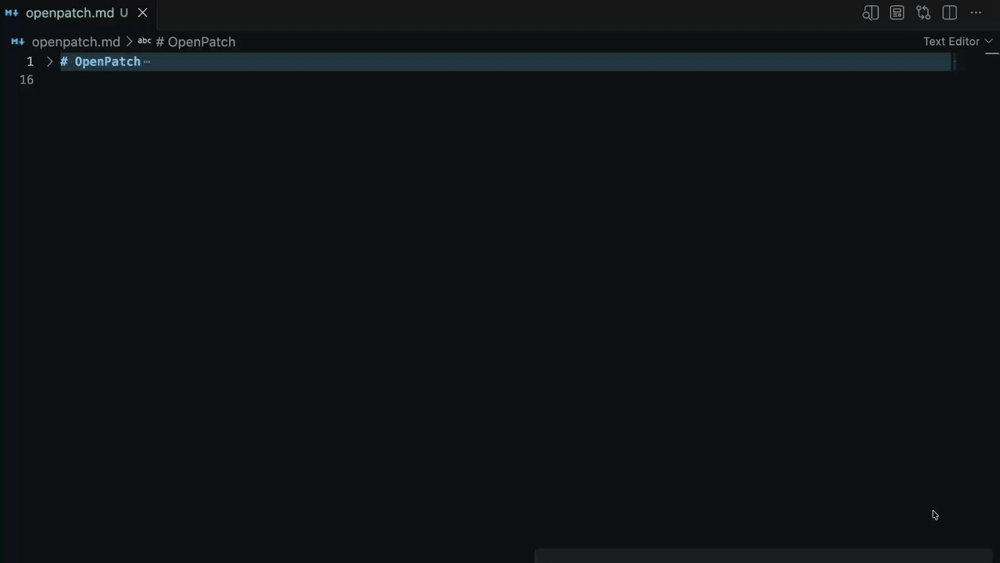

<p align="center">
  
</p>

<h1 align="center">OpenPatch</h1>

<p align="center"><strong>Edit Markdown in VS Code with the AI you choose.</strong></p>

<p align="center">Select text. Describe the edit. Get a patch in place.</p>

OpenPatch is a VS Code extension that rewrites selected Markdown without leaving your editor. Select a passage, tell it what to change, and OpenPatch replaces that selection with a streamed AI patch.

**No chat copy-paste.** No moving text into a browser, waiting on a conversation, then pasting an answer back into your file. Your edit happens where you write.



## What you do

1. Select the Markdown you want to change.
2. Enter an instruction, such as `make this more concise` or `turn this into a checklist`.
3. OpenPatch streams the replacement directly into that selection.

It is that simple. Automatic patching opens the instruction prompt when you select text; turn it off if you prefer to run **OpenPatch: Patch Selected Markdown** yourself from the Command Palette.

## Install

Install **OpenPatch** from the Visual Studio Marketplace, or download a release `.vsix` and use **Extensions: Install from VSIX...** in VS Code.

## Bring your own AI

OpenPatch works with OpenAI-compatible Chat Completions endpoints. Bring the provider, model, and API key that fit your work: a hosted API, an internal gateway, or a local model server.

**Batteries not included.** OpenPatch does not include a model, an AI subscription, or a hosted service. You provide the endpoint and, when it needs one, the API key. Your data and AI spend stay under your control.

For every patch, OpenPatch sends your instruction, selected Markdown, and the active Markdown document as context to the endpoint you configure. Use an endpoint you trust and avoid selecting content you would not share with its operator.

## Set it up

In VS Code Settings, configure these three essentials:

| Setting | What it controls |
| --- | --- |
| `openpatch.openAiBaseUrl` | Your OpenAI-compatible API base URL. HTTPS is required except for loopback addresses. |
| `openpatch.model` | The model name sent to that endpoint. |
| `openpatch.systemPrompt` | The instructions that govern the patch. |

Then run **OpenPatch: Set API Key** to store an optional bearer key in VS Code SecretStorage. If your endpoint does not require a key, leave it unset.

### Useful controls

| Setting or command | What it does |
| --- | --- |
| `openpatch.requestTimeoutMs` | Sets the request timeout, from 1 second to 5 minutes. |
| `openpatch.maxConcurrentPatches` | Limits how many independent selections can be patched at once. |
| `openpatch.chatTemplateKwargs` | Passes endpoint-specific chat-template options, such as `{ "enable_thinking": false }`. |
| **OpenPatch: Toggle Automatic Patching** | Enables or disables selection-triggered patching. |
| **OpenPatch: Clear API Key** | Removes the stored key from VS Code SecretStorage. |

## For contributors

OpenPatch requires Node.js 22 or newer.

```bash
npm ci
npm test
npm run package:vsix
```

`npm run package:vsix` creates `openpatch-<version>.vsix`. Test it in VS Code with:

```bash
code --install-extension openpatch-<version>.vsix
```

Read [CONTRIBUTING.md](CONTRIBUTING.md) before opening a pull request. Bug reports and feature ideas belong in [GitHub Issues](https://github.com/NoxelS/openpatch/issues). For support, security reporting, and release information, see [SUPPORT.md](SUPPORT.md), [SECURITY.md](SECURITY.md), and [RELEASING.md](RELEASING.md).

## License

OpenPatch is available under the [MIT License](LICENSE).
